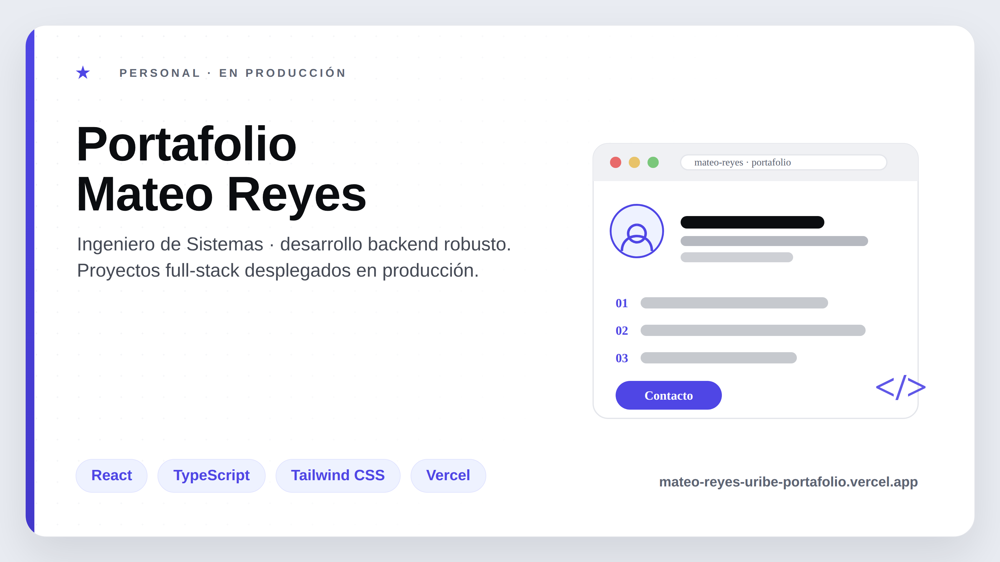
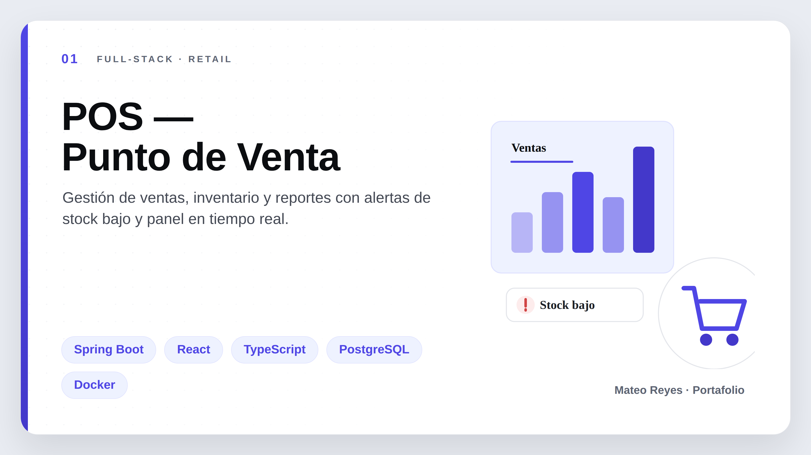
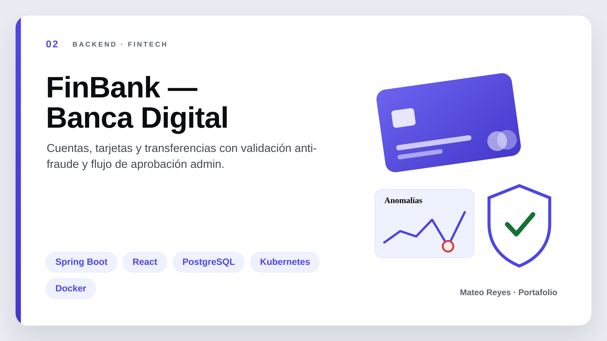
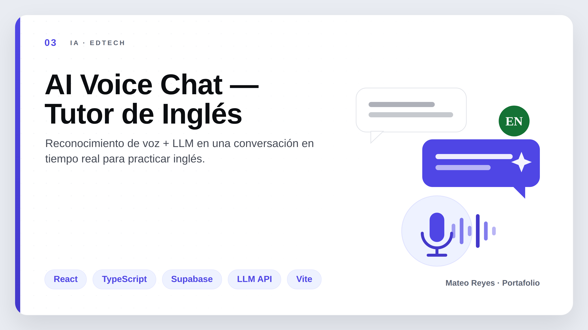
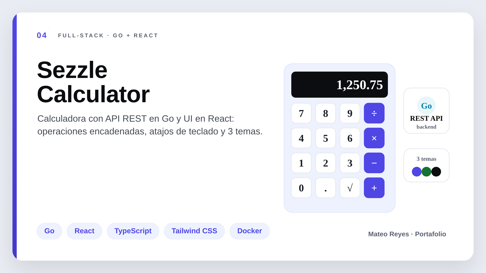
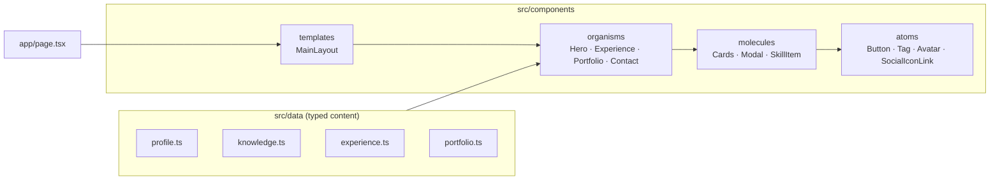
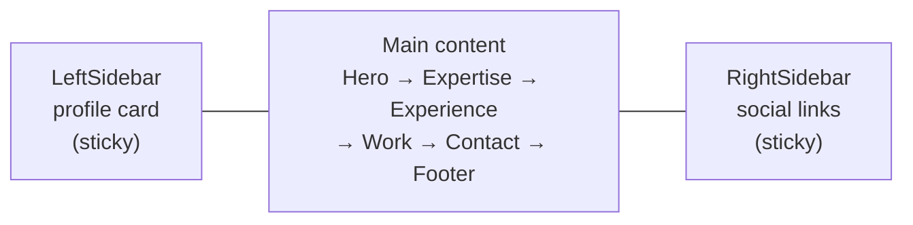

<div align="center">



# Mateo Reyes Uribe — Portfolio

**Backend Developer · Systems Engineering student at Universidad de Antioquia**

Java · Spring Boot · PostgreSQL · Docker

[](https://mateo-reyes-uribe-portafolio.vercel.app/)
[](https://www.linkedin.com/in/mateo-reyes-uribe)
[](https://github.com/mateor32)


</div>

---

## About

A single-page portfolio and résumé built to be read by recruiters in under a
minute: a fixed profile card on the left, expertise, experience and projects
in the middle, and social links on the right.

It is **100% frontend and fully static** — no server, no database, no forms.
Contact goes through `mailto:` and `tel:` links, and every piece of content
lives in typed data files under `src/data/`, so updating the portfolio means
editing one file and pushing.

**Highlights**

- ⚡ Static generation with Next.js App Router — prerendered HTML, no runtime.
- 🧱 Components organised with **Atomic Design** (atoms → molecules → organisms → templates).
- 🎨 A single-accent design system: one indigo over a long neutral ramp.
- ♿ WCAG AA contrast on every text pair, focus-trapped dialogs, reduced-motion support.
- 🔒 Fully typed content: add a field to a type and the compiler points at every data file that needs it.

---

## Featured projects

<table>
  <tr>
    <td width="50%" valign="top">
      <a href="https://pos-system-chi-beryl.vercel.app"></a>
      <h3>POS — Point of Sale</h3>
      <p>Sales, inventory and reporting with low-stock alerts. Layered REST API (controller → service → repository) that held zero integrity errors across 500+ test records.</p>
      <p>
        
        
        
        
      </p>
      <a href="https://pos-system-chi-beryl.vercel.app"><b>Live demo →</b></a>
    </td>
    <td width="50%" valign="top">
      <a href="https://github.com/mateor32/fraude-detection"></a>
      <h3>FinBank — Banking Backend</h3>
      <p>Accounts, transfers and history with JWT authentication, bcrypt hashing and an anomaly-detection module that flags unusual transactions.</p>
      <p>
        
        
        
        
      </p>
      <b>🚧 Live demo coming soon</b>
    </td>
  </tr>
  <tr>
    <td width="50%" valign="top">
      <a href="https://ai-english-chat-rosy.vercel.app"></a>
      <h3>AI Voice Chat — English Tutor</h3>
      <p>Speech-to-text plus an LLM in a real-time English conversation, with average latency under two seconds.</p>
      <p>
        
        
        
      </p>
      <a href="https://ai-english-chat-rosy.vercel.app"><b>Live demo →</b></a>
    </td>
    <td width="50%" valign="top">
      <a href="https://sezzle-calculator-theta.vercel.app/"></a>
      <h3>Sezzle Calculator</h3>
      <p>A calculator whose operations are resolved by a Go REST API, with a React client, chained operations, keyboard shortcuts and three themes.</p>
      <p>
        
        
        
        
      </p>
      <a href="https://sezzle-calculator-theta.vercel.app/"><b>Live demo →</b></a>
    </td>
  </tr>
</table>

---

## Architecture

The page is one static route composed from a three-column template. Organisms
are the only layer that reads from `src/data/`; everything below them receives
its content through props.



### Page layout



Below `lg` both sidebars collapse: the profile moves into a slide-in menu and
the social links move to the footer.

### Folder structure

```
src/
├── app/                  App Router: layout, page, global styles
├── components/
│   ├── atoms/            Indivisible pieces, no business logic
│   ├── molecules/        Small combinations of atoms
│   ├── organisms/        Full sections, wired to the data
│   └── templates/        Page structure
├── data/                 All editable content, typed
├── hooks/                useDialogBehavior (focus trap, Esc, scroll lock)
├── lib/                  cn() helper, icon registry, motion variants
└── types/                Shared types for data and props
```

---

## Tech stack

| Tool | Role |
| --- | --- |
| **Next.js 16** (App Router) | Framework and static generation |
| **React 19** | UI |
| **TypeScript** (strict) | Typing for data and props |
| **Tailwind CSS 3.4** | Utility-first styling, design tokens in `tailwind.config.ts` |
| **Framer Motion** | Entrance animations, modals, 3D card tilt |
| **lucide-react** | Interface icons |
| **react-icons** | Brand logos only |

> Tailwind is pinned to 3.4 on purpose: version 4 replaces the config file with
> the `@theme` directive, and this project defines its design system in
> `tailwind.config.ts`.

---

## Design system

The direction is **editorial**: a clearly grey page background so white cards
float on it, strong typographic hierarchy, numbered section labels in small
caps and generous spacing. Indigo is the only brand colour — anything that
looks like more colour is a gradient or an opacity of that same tone.

| Swatch | Token | Value | Use |
| :---: | --- | --- | --- |
|  | `accent` | `#4F46E5` | CTAs, links, progress, hover |
|  | `accent-deep` | `#4338CA` | Accent gradients |
|  | `accent-night` | `#1E1B4B` | Dark blocks |
|  | `accent-soft` | `#EEF2FF` | Tag and icon backgrounds |
|  | `ink` | `#0B0D10` | Headings |
|  | `ink-soft` | `#1C1F26` | Body copy |
|  | `muted` | `#5D6473` | Supporting text |
|  | `line` | `#E4E6EB` | Borders |
|  | `bg` | `#E9ECF2` | Page background |
|  | `success` | `#15803D` | "Available" status |

Conventions: `rounded-xl` on cards, `rounded-full` on avatars, tags and circular
icons, `rounded-md` on buttons, `shadow-sm` at rest and `shadow-md` on hover.
Large type sizes use `clamp()` so they scale continuously with the viewport.

---

## Accessibility

- Every text pair meets **WCAG AA (4.5:1)**, checked one by one.
- Every image has alternative text; every icon-only control has an `aria-label`.
- A global `:focus-visible` ring, so no component can forget it.
- Dialogs trap focus, close on `Esc` and return focus to their trigger.
- Both CSS and Framer Motion animations respect `prefers-reduced-motion`.

---

## Getting started

Requires **Node.js 20+**.

```bash
git clone https://github.com/mateor32/mateo-reyes-uribe-portafolio.git
cd mateo-reyes-uribe-portafolio
npm install
npm run dev
```

Open <http://localhost:3000>.

| Command | What it does |
| --- | --- |
| `npm run dev` | Development server with hot reload |
| `npm run build` | Production build |
| `npm run start` | Serves the production build |
| `npm run lint` | ESLint across the project |

### Editing the content

| To change… | Edit |
| --- | --- |
| Name, bio, contact, languages, stack, social links | `src/data/profile.ts` |
| Expertise cards | `src/data/knowledge.ts` |
| Experience timeline | `src/data/experience.ts` |
| Projects, links and "coming soon" flags | `src/data/portfolio.ts` |
| Project covers | `public/images/portfolio/` |

Until a cover image exists, `ProjectImage` shows a placeholder instead of a
broken image and swaps itself out as soon as the file is added.

---

## Deployment

The site is deployed on **Vercel** with zero configuration: every push to
`main` goes to production and every branch gets its own preview URL. The build
is fully static — no server functions, no environment variables.

---

<div align="center">

**Mateo Reyes Uribe** · Medellín, Colombia

[mateo-reyes-uribe-portafolio.vercel.app](https://mateo-reyes-uribe-portafolio.vercel.app/) ·
[LinkedIn](https://www.linkedin.com/in/mateo-reyes-uribe) ·
[GitHub](https://github.com/mateor32)

Open to a professional internship for **2027-1**.

</div>
